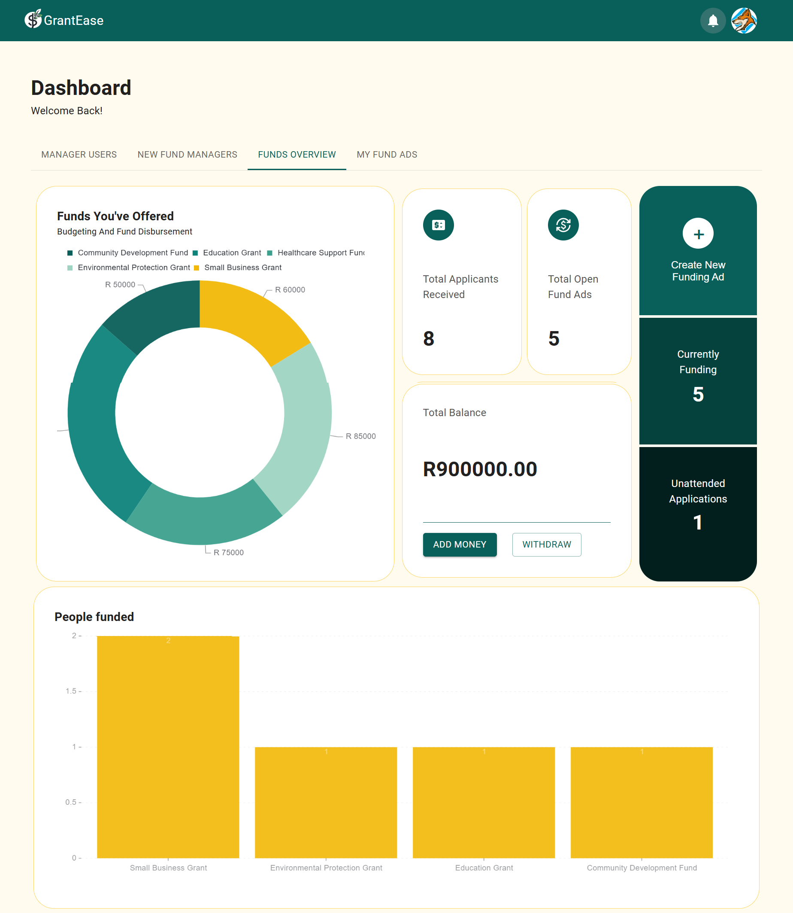

# Grant-Ease

Grant-Ease is an Android application designed to streamline the process of applying for funding and tracking funding applications. The app provides functionality for users to apply for funding opportunities, manage their applications, and stay updated on their application status. Fund managers can create and manage funding opportunities, and admins have the tools to manage users and their roles within the application.

## Features

- **Apply for Funding:** Users can browse and apply for available funding opportunities.
- **Track Applications:** Users can track the status of their funding applications in real-time.
- **Fund Manager Dashboard:** Fund managers can create funding opportunities and use a dashboard to manage applicants and funding allocations.
- **Admin Controls:** Admins can create, ban users, and change user roles to ensure proper management and security within the app.

## Screenshots

1. **Sign-In**
   

2. **Home Screen** and **Application Tracking**
    
     


3. **Fund Manager Dashboard** and **Manage Applications**
    
    
    

4. **Manage Users** and **Role Change**
   
   

[](https://codecov.io/gh/TheNumbered/grant-ease)
<br/>
## Code Coverage Graph


## Getting Started

### Prerequisites

Make sure you have the following software installed on your machine:
- [Node.js](https://nodejs.org/)
- [PNPM](https://pnpm.io/)

### Installation

1. Clone the repository.
    ```shell
    git clone https://github.com/TheNumbered/grant-ease.git
    ```

2. Navigate to the project directory.
    ```shell
    cd grant-ease
    ```

3. Install the global dependencies.
    ```shell
    npm run install-global-dep
    ```

4. Install the dependencies for each module.
    ```shell
    pnpm  install
    ```

## Configure App

To configure the app, you need to set the following environment variables:

### Frontend Environment Variables

- `VITE_API_URL`: The API URL for the backend server.
- `VITE_CLERK_PUBLISHABLE_KEY`: The publishable key for Clerk authentication. (https://clerk.com/docs/quickstarts/react)

### Backend Environment Variables

- `CLERK_SECRET_KEY`: The secret key for Clerk authentication. (https://clerk.com/docs/quickstarts/react)
- `MYSQL_DATABASE`: The name of the MySQL database.
- `MYSQL_HOST`: The host of the MySQL database.
- `MYSQL_PASSWORD`: The password for the MySQL database.
- `MYSQL_PORT`: The port of the MySQL database.
- `MYSQL_USER`: The username for the MySQL database.

Make sure to set these environment variables before running the app.

## Usage

- To start the backend server, run the following command:
    ```shell
    pnpm backend
    ```

- To start the frontend development server, run the following command:
    ```shell
    pnpm frontend
    ```

- To build the frontend for production, run the following command:
    ```shell
    pnpm build
    ```

## Testing

- To run tests, use the following command:
    ```shell
    pnpm test
    ```

- To generate test coverage report, use the following command:
    ```shell
    pnpm coverage
    ```
*For database migrations read the README.MD in backend/db/README.MD

*Note: Some files are hidden by default. To show these files, navigate to `.vscode/settings.json` and comment out the file you want to show.*

# Acknowledgments
This project was developed as part of the Software Design course at Wits University by the following team:

Daniel Ngobe,
Karabo Joshua,
Kharendwe Negota,
Theophilus Kgopa,
Sisekelo Ngcobo,
Aphile Bulube